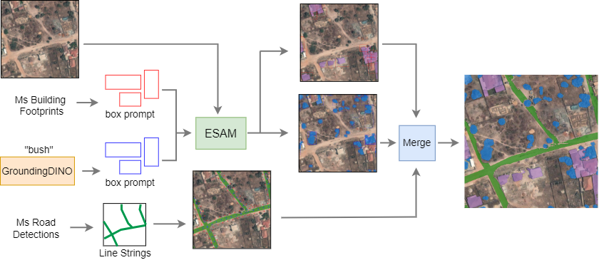

# FMARS: Annotating Remote Sensing Images for Disaster Management using Foundation Models

Dataset and code for generating the dataset described in the paper *FMARS: Annotating Remote Sensing Images for Disaster Management using Foundation Models*.



[](https://arxiv.org/abs/2405.20109)

> **Note:** The dataset is available at [Hugging Face Datasets](https://huggingface.co/datasets/links-ads/fmars-dataset).

## Environment Setup

### Python Virtual Environment

We recommend using Python version 3.10.12 for this project. Set up a new virtual environment using the following commands:

```shell
pyenv install 3.10.12
pyenv global 3.10.12
python -m venv .venv
source .venv/bin/activate
```

Install the required Python packages with:
```shell
pip install -r requirements.txt
```
### Resources
Download necessary metadata using:
```shell
wget -q https://github.com/links-ads/igarss-fmars-gen/releases/download/v0.1.0/metadata.zip
unzip metadata.zip
rm metadata.zip
```
### Model Weights

Download the model weights for **Grounding DINO** and **EfficientSAM**:

- **Grounding DINO**:
```shell
cd models/GDINO/weights
wget -q https://github.com/IDEA-Research/GroundingDINO/releases/download/v0.1.0-alpha/groundingdino_swint_ogc.pth
cd ../../..
```

- **EfficientSAM**:
  Download the checkpoint from [this link](https://github.com/yformer/EfficientSAM/blob/main/weights/efficient_sam_vitt.pt) and place it in `models/efficientSAM/weights/`.

### Data Acquisition

- **Maxar Images**:

**⚠️ WARNING:** Downloading all necessary Maxar images requires more than 900 GB of free space and several hours.
```shell
python src/maxarseg/scripts/downloadMaxar.py
```

- **Microsoft Road Detections**:
```shell
python src/maxarseg/scripts/downloadRoads.py
```
## Usage
You can run the automatic labelling process on a whole event or on a partition of an event using a single command. The event is specified by its index, which can be an integer for a whole event or a decimal for a partition.

```shell
python -B -O -m maxarseg --out_dir_root <path/to/output/directory> \
        --config "<path/to/config/file>" \
        --event_ix <event_index>
```
### Parameters

`--out_dir_root`: Specifies the output directory for the labelling results.

`--config`: Path to the configuration file (e.g., "./configs/trees_cfg.yaml").

`--event_ix`: Index of the event to process.
* Use an integer (e.g., 0, 1, 2) to process a whole event.
* Use a decimal from x.0 to x.9 (e.g., 0.0, 0.1, ..., 0.9) to process a partition of an event.

## Acknowledgements

FMARS leverages several open-source projects. We extend our gratitude to the authors of the following tools for making their software publicly available:

- [Grounding DINO](https://github.com/IDEA-Research/GroundingDINO)
- [EfficientSAM](https://github.com/yformer/EfficientSAM)